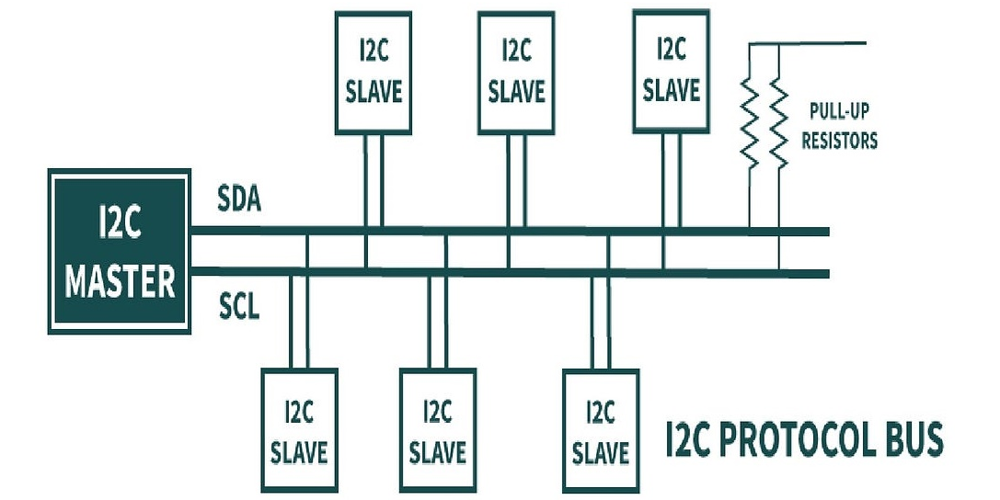
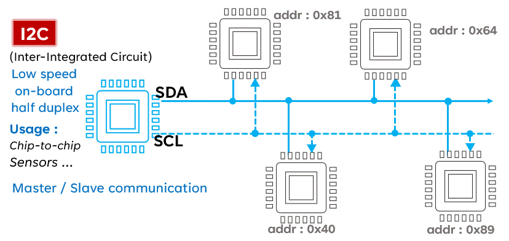
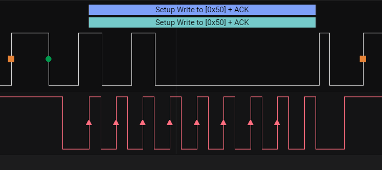

# I2C Communication – Complete Professional Tutorial

## 📌 Introduction
Inter-Integrated Circuit (I2C) is a synchronous, multi-master, multi-slave communication protocol widely used for short-distance communication between microcontrollers and peripherals like sensors, EEPROMs, RTCs, and displays.

---

## 🧠 Key Concepts

- **Two-wire interface**:
  - SDA (Serial Data Line)
  - SCL (Serial Clock Line)
- **Master-Slave architecture**
- **Half-duplex communication**
- **Address-based communication**

---

## [🌐 I²C Communication Simulator Link](I2C_Communication_Simulator.html)

---

## 🔌 Basic I2C Connection Diagram



---

## 🎞️ I2C Working Animation (GIF)



---

## ⚙️ How I2C Works (Step-by-Step)

### 1. Start Condition
- Master pulls SDA LOW while SCL is HIGH

### 2. Address Frame
- 7-bit or 10-bit address
- 1 bit for Read/Write

### 3. ACK/NACK
- Receiver pulls SDA LOW (ACK)

### 4. Data Transfer
- 8-bit data packets

### 5. Stop Condition
- SDA goes HIGH while SCL is HIGH

---

## 📦 Data Format

```
| START | ADDRESS (7/10 bit) | R/W | ACK | DATA (8-bit) | ACK | STOP |
```

---

## 🔢 7-bit vs 10-bit Addressing

### 7-bit Addressing
- Most common
- 128 devices possible

### 10-bit Addressing
- Extended addressing
- Rarely used

---

## 📥 8-bit vs 16-bit Register Addressing

Many I2C devices use internal registers.

### 8-bit Register Example
- EEPROM small size

### 16-bit Register Example
- Large EEPROM or sensors

---

## 🔁 Read & Write Flow

### 📝 Write Operation
1. Start
2. Send device address + Write
3. Send register address
4. Send data
5. Stop

### 📖 Read Operation
1. Start
2. Send device address + Write
3. Send register address
4. Repeated Start
5. Send device address + Read
6. Read data
7. Stop

---

## 🧩 ESP-IDF I2C Examples

The examples below cover all common combinations:

- 8-bit memory/register address + 8-bit data
- 8-bit memory/register address + 16-bit data
- 16-bit memory/register address + 8-bit data
- 16-bit memory/register address + 16-bit data
- single-byte read/write
- multi-byte read/write

### ESP-IDF Setup

```c
#include "driver/i2c.h"
#include "esp_err.h"
#include <string.h>

#define I2C_MASTER_SCL_IO         22
#define I2C_MASTER_SDA_IO         21
#define I2C_MASTER_PORT           I2C_NUM_0
#define I2C_MASTER_FREQ_HZ        100000
#define I2C_MASTER_TIMEOUT_MS     1000

static esp_err_t i2c_master_init(void)
{
    i2c_config_t conf = {
        .mode = I2C_MODE_MASTER,
        .sda_io_num = I2C_MASTER_SDA_IO,
        .scl_io_num = I2C_MASTER_SCL_IO,
        .sda_pullup_en = GPIO_PULLUP_ENABLE,
        .scl_pullup_en = GPIO_PULLUP_ENABLE,
        .master.clk_speed = I2C_MASTER_FREQ_HZ,
    };

    ESP_ERROR_CHECK(i2c_param_config(I2C_MASTER_PORT, &conf));
    return i2c_driver_install(I2C_MASTER_PORT, conf.mode, 0, 0, 0);
}
```

### 1) Write 8-bit Data to 8-bit Register Address

```c
esp_err_t i2c_write_reg8_data8(uint8_t dev_addr, uint8_t reg_addr, uint8_t data)
{
    i2c_cmd_handle_t cmd = i2c_cmd_link_create();
    i2c_master_start(cmd);
    i2c_master_write_byte(cmd, (dev_addr << 1) | I2C_MASTER_WRITE, true);
    i2c_master_write_byte(cmd, reg_addr, true);
    i2c_master_write_byte(cmd, data, true);
    i2c_master_stop(cmd);

    esp_err_t ret = i2c_master_cmd_begin(I2C_MASTER_PORT, cmd,
                                         pdMS_TO_TICKS(I2C_MASTER_TIMEOUT_MS));
    i2c_cmd_link_delete(cmd);
    return ret;
}
```

### 2) Read 8-bit Data from 8-bit Register Address

```c
esp_err_t i2c_read_reg8_data8(uint8_t dev_addr, uint8_t reg_addr, uint8_t *data)
{
    if (data == NULL) return ESP_ERR_INVALID_ARG;

    i2c_cmd_handle_t cmd = i2c_cmd_link_create();
    i2c_master_start(cmd);
    i2c_master_write_byte(cmd, (dev_addr << 1) | I2C_MASTER_WRITE, true);
    i2c_master_write_byte(cmd, reg_addr, true);

    i2c_master_start(cmd); // repeated start
    i2c_master_write_byte(cmd, (dev_addr << 1) | I2C_MASTER_READ, true);
    i2c_master_read_byte(cmd, data, I2C_MASTER_NACK);
    i2c_master_stop(cmd);

    esp_err_t ret = i2c_master_cmd_begin(I2C_MASTER_PORT, cmd,
                                         pdMS_TO_TICKS(I2C_MASTER_TIMEOUT_MS));
    i2c_cmd_link_delete(cmd);
    return ret;
}
```

### 3) Write 16-bit Data to 8-bit Register Address

```c
esp_err_t i2c_write_reg8_data16(uint8_t dev_addr, uint8_t reg_addr, uint16_t data)
{
    uint8_t tx[2];
    tx[0] = (uint8_t)(data >> 8);   // high byte first
    tx[1] = (uint8_t)(data & 0xFF); // low byte

    i2c_cmd_handle_t cmd = i2c_cmd_link_create();
    i2c_master_start(cmd);
    i2c_master_write_byte(cmd, (dev_addr << 1) | I2C_MASTER_WRITE, true);
    i2c_master_write_byte(cmd, reg_addr, true);
    i2c_master_write(cmd, tx, sizeof(tx), true);
    i2c_master_stop(cmd);

    esp_err_t ret = i2c_master_cmd_begin(I2C_MASTER_PORT, cmd,
                                         pdMS_TO_TICKS(I2C_MASTER_TIMEOUT_MS));
    i2c_cmd_link_delete(cmd);
    return ret;
}
```

### 4) Read 16-bit Data from 8-bit Register Address

```c
esp_err_t i2c_read_reg8_data16(uint8_t dev_addr, uint8_t reg_addr, uint16_t *data)
{
    if (data == NULL) return ESP_ERR_INVALID_ARG;

    uint8_t rx[2] = {0};
    i2c_cmd_handle_t cmd = i2c_cmd_link_create();

    i2c_master_start(cmd);
    i2c_master_write_byte(cmd, (dev_addr << 1) | I2C_MASTER_WRITE, true);
    i2c_master_write_byte(cmd, reg_addr, true);

    i2c_master_start(cmd);
    i2c_master_write_byte(cmd, (dev_addr << 1) | I2C_MASTER_READ, true);
    i2c_master_read(cmd, rx, 1, I2C_MASTER_ACK);
    i2c_master_read_byte(cmd, &rx[1], I2C_MASTER_NACK);
    i2c_master_stop(cmd);

    esp_err_t ret = i2c_master_cmd_begin(I2C_MASTER_PORT, cmd,
                                         pdMS_TO_TICKS(I2C_MASTER_TIMEOUT_MS));
    i2c_cmd_link_delete(cmd);

    if (ret == ESP_OK) {
        *data = ((uint16_t)rx[0] << 8) | rx[1];
    }
    return ret;
}
```

### 5) Write 8-bit Data to 16-bit Register Address

```c
esp_err_t i2c_write_reg16_data8(uint8_t dev_addr, uint16_t reg_addr, uint8_t data)
{
    i2c_cmd_handle_t cmd = i2c_cmd_link_create();
    i2c_master_start(cmd);
    i2c_master_write_byte(cmd, (dev_addr << 1) | I2C_MASTER_WRITE, true);
    i2c_master_write_byte(cmd, (uint8_t)(reg_addr >> 8), true);   // reg high
    i2c_master_write_byte(cmd, (uint8_t)(reg_addr & 0xFF), true); // reg low
    i2c_master_write_byte(cmd, data, true);
    i2c_master_stop(cmd);

    esp_err_t ret = i2c_master_cmd_begin(I2C_MASTER_PORT, cmd,
                                         pdMS_TO_TICKS(I2C_MASTER_TIMEOUT_MS));
    i2c_cmd_link_delete(cmd);
    return ret;
}
```

### 6) Read 8-bit Data from 16-bit Register Address

```c
esp_err_t i2c_read_reg16_data8(uint8_t dev_addr, uint16_t reg_addr, uint8_t *data)
{
    if (data == NULL) return ESP_ERR_INVALID_ARG;

    i2c_cmd_handle_t cmd = i2c_cmd_link_create();
    i2c_master_start(cmd);
    i2c_master_write_byte(cmd, (dev_addr << 1) | I2C_MASTER_WRITE, true);
    i2c_master_write_byte(cmd, (uint8_t)(reg_addr >> 8), true);
    i2c_master_write_byte(cmd, (uint8_t)(reg_addr & 0xFF), true);

    i2c_master_start(cmd);
    i2c_master_write_byte(cmd, (dev_addr << 1) | I2C_MASTER_READ, true);
    i2c_master_read_byte(cmd, data, I2C_MASTER_NACK);
    i2c_master_stop(cmd);

    esp_err_t ret = i2c_master_cmd_begin(I2C_MASTER_PORT, cmd,
                                         pdMS_TO_TICKS(I2C_MASTER_TIMEOUT_MS));
    i2c_cmd_link_delete(cmd);
    return ret;
}
```

### 7) Write 16-bit Data to 16-bit Register Address

```c
esp_err_t i2c_write_reg16_data16(uint8_t dev_addr, uint16_t reg_addr, uint16_t data)
{
    uint8_t tx[2];
    tx[0] = (uint8_t)(data >> 8);
    tx[1] = (uint8_t)(data & 0xFF);

    i2c_cmd_handle_t cmd = i2c_cmd_link_create();
    i2c_master_start(cmd);
    i2c_master_write_byte(cmd, (dev_addr << 1) | I2C_MASTER_WRITE, true);
    i2c_master_write_byte(cmd, (uint8_t)(reg_addr >> 8), true);
    i2c_master_write_byte(cmd, (uint8_t)(reg_addr & 0xFF), true);
    i2c_master_write(cmd, tx, sizeof(tx), true);
    i2c_master_stop(cmd);

    esp_err_t ret = i2c_master_cmd_begin(I2C_MASTER_PORT, cmd,
                                         pdMS_TO_TICKS(I2C_MASTER_TIMEOUT_MS));
    i2c_cmd_link_delete(cmd);
    return ret;
}
```

### 8) Read 16-bit Data from 16-bit Register Address

```c
esp_err_t i2c_read_reg16_data16(uint8_t dev_addr, uint16_t reg_addr, uint16_t *data)
{
    if (data == NULL) return ESP_ERR_INVALID_ARG;

    uint8_t rx[2] = {0};
    i2c_cmd_handle_t cmd = i2c_cmd_link_create();

    i2c_master_start(cmd);
    i2c_master_write_byte(cmd, (dev_addr << 1) | I2C_MASTER_WRITE, true);
    i2c_master_write_byte(cmd, (uint8_t)(reg_addr >> 8), true);
    i2c_master_write_byte(cmd, (uint8_t)(reg_addr & 0xFF), true);

    i2c_master_start(cmd);
    i2c_master_write_byte(cmd, (dev_addr << 1) | I2C_MASTER_READ, true);
    i2c_master_read(cmd, rx, 1, I2C_MASTER_ACK);
    i2c_master_read_byte(cmd, &rx[1], I2C_MASTER_NACK);
    i2c_master_stop(cmd);

    esp_err_t ret = i2c_master_cmd_begin(I2C_MASTER_PORT, cmd,
                                         pdMS_TO_TICKS(I2C_MASTER_TIMEOUT_MS));
    i2c_cmd_link_delete(cmd);

    if (ret == ESP_OK) {
        *data = ((uint16_t)rx[0] << 8) | rx[1];
    }
    return ret;
}
```

### 9) Multi-byte Read from 8-bit Register Address

```c
esp_err_t i2c_read_reg8_buffer(uint8_t dev_addr, uint8_t reg_addr, uint8_t *buf, size_t len)
{
    if (buf == NULL || len == 0) return ESP_ERR_INVALID_ARG;

    i2c_cmd_handle_t cmd = i2c_cmd_link_create();
    i2c_master_start(cmd);
    i2c_master_write_byte(cmd, (dev_addr << 1) | I2C_MASTER_WRITE, true);
    i2c_master_write_byte(cmd, reg_addr, true);

    i2c_master_start(cmd);
    i2c_master_write_byte(cmd, (dev_addr << 1) | I2C_MASTER_READ, true);

    if (len > 1) {
        i2c_master_read(cmd, buf, len - 1, I2C_MASTER_ACK);
    }
    i2c_master_read_byte(cmd, &buf[len - 1], I2C_MASTER_NACK);
    i2c_master_stop(cmd);

    esp_err_t ret = i2c_master_cmd_begin(I2C_MASTER_PORT, cmd,
                                         pdMS_TO_TICKS(I2C_MASTER_TIMEOUT_MS));
    i2c_cmd_link_delete(cmd);
    return ret;
}
```

### 10) Multi-byte Write to 16-bit Register Address

```c
esp_err_t i2c_write_reg16_buffer(uint8_t dev_addr, uint16_t reg_addr, const uint8_t *buf, size_t len)
{
    if (buf == NULL || len == 0) return ESP_ERR_INVALID_ARG;

    i2c_cmd_handle_t cmd = i2c_cmd_link_create();
    i2c_master_start(cmd);
    i2c_master_write_byte(cmd, (dev_addr << 1) | I2C_MASTER_WRITE, true);
    i2c_master_write_byte(cmd, (uint8_t)(reg_addr >> 8), true);
    i2c_master_write_byte(cmd, (uint8_t)(reg_addr & 0xFF), true);
    i2c_master_write(cmd, (uint8_t *)buf, len, true);
    i2c_master_stop(cmd);

    esp_err_t ret = i2c_master_cmd_begin(I2C_MASTER_PORT, cmd,
                                         pdMS_TO_TICKS(I2C_MASTER_TIMEOUT_MS));
    i2c_cmd_link_delete(cmd);
    return ret;
}
```

### ESP-IDF Example Usage

```c
void app_main(void)
{
    ESP_ERROR_CHECK(i2c_master_init());

    uint8_t value8;
    uint16_t value16;

    // Device address example: 0x50
    i2c_write_reg8_data8(0x50, 0x10, 0xAB);
    i2c_read_reg8_data8(0x50, 0x10, &value8);

    i2c_write_reg8_data16(0x50, 0x20, 0x1234);
    i2c_read_reg8_data16(0x50, 0x20, &value16);

    i2c_write_reg16_data8(0x50, 0x1234, 0x5A);
    i2c_read_reg16_data8(0x50, 0x1234, &value8);

    i2c_write_reg16_data16(0x50, 0x1234, 0xBEEF);
    i2c_read_reg16_data16(0x50, 0x1234, &value16);
}
```

---

## 🧩 STM32 HAL Examples

STM32 HAL provides very convenient memory read/write APIs for I2C peripherals.

### STM32 Setup Assumption

```c
#include "stm32f1xx_hal.h"

extern I2C_HandleTypeDef hi2c1;
```

### 1) Write 8-bit Data to 8-bit Memory Address

```c
HAL_StatusTypeDef stm32_write_mem8_data8(uint16_t dev_addr, uint16_t mem_addr, uint8_t data)
{
    return HAL_I2C_Mem_Write(&hi2c1,
                             dev_addr << 1,
                             mem_addr,
                             I2C_MEMADD_SIZE_8BIT,
                             &data,
                             1,
                             100);
}
```

### 2) Read 8-bit Data from 8-bit Memory Address

```c
HAL_StatusTypeDef stm32_read_mem8_data8(uint16_t dev_addr, uint16_t mem_addr, uint8_t *data)
{
    return HAL_I2C_Mem_Read(&hi2c1,
                            dev_addr << 1,
                            mem_addr,
                            I2C_MEMADD_SIZE_8BIT,
                            data,
                            1,
                            100);
}
```

### 3) Write 16-bit Data to 8-bit Memory Address

```c
HAL_StatusTypeDef stm32_write_mem8_data16(uint16_t dev_addr, uint16_t mem_addr, uint16_t data)
{
    uint8_t tx[2];
    tx[0] = (uint8_t)(data >> 8);
    tx[1] = (uint8_t)(data & 0xFF);

    return HAL_I2C_Mem_Write(&hi2c1,
                             dev_addr << 1,
                             mem_addr,
                             I2C_MEMADD_SIZE_8BIT,
                             tx,
                             2,
                             100);
}
```

### 4) Read 16-bit Data from 8-bit Memory Address

```c
HAL_StatusTypeDef stm32_read_mem8_data16(uint16_t dev_addr, uint16_t mem_addr, uint16_t *data)
{
    uint8_t rx[2] = {0};
    HAL_StatusTypeDef ret = HAL_I2C_Mem_Read(&hi2c1,
                                             dev_addr << 1,
                                             mem_addr,
                                             I2C_MEMADD_SIZE_8BIT,
                                             rx,
                                             2,
                                             100);
    if (ret == HAL_OK && data != NULL) {
        *data = ((uint16_t)rx[0] << 8) | rx[1];
    }
    return ret;
}
```

### 5) Write 8-bit Data to 16-bit Memory Address

```c
HAL_StatusTypeDef stm32_write_mem16_data8(uint16_t dev_addr, uint16_t mem_addr, uint8_t data)
{
    return HAL_I2C_Mem_Write(&hi2c1,
                             dev_addr << 1,
                             mem_addr,
                             I2C_MEMADD_SIZE_16BIT,
                             &data,
                             1,
                             100);
}
```

### 6) Read 8-bit Data from 16-bit Memory Address

```c
HAL_StatusTypeDef stm32_read_mem16_data8(uint16_t dev_addr, uint16_t mem_addr, uint8_t *data)
{
    return HAL_I2C_Mem_Read(&hi2c1,
                            dev_addr << 1,
                            mem_addr,
                            I2C_MEMADD_SIZE_16BIT,
                            data,
                            1,
                            100);
}
```

### 7) Write 16-bit Data to 16-bit Memory Address

```c
HAL_StatusTypeDef stm32_write_mem16_data16(uint16_t dev_addr, uint16_t mem_addr, uint16_t data)
{
    uint8_t tx[2];
    tx[0] = (uint8_t)(data >> 8);
    tx[1] = (uint8_t)(data & 0xFF);

    return HAL_I2C_Mem_Write(&hi2c1,
                             dev_addr << 1,
                             mem_addr,
                             I2C_MEMADD_SIZE_16BIT,
                             tx,
                             2,
                             100);
}
```

### 8) Read 16-bit Data from 16-bit Memory Address

```c
HAL_StatusTypeDef stm32_read_mem16_data16(uint16_t dev_addr, uint16_t mem_addr, uint16_t *data)
{
    uint8_t rx[2] = {0};
    HAL_StatusTypeDef ret = HAL_I2C_Mem_Read(&hi2c1,
                                             dev_addr << 1,
                                             mem_addr,
                                             I2C_MEMADD_SIZE_16BIT,
                                             rx,
                                             2,
                                             100);
    if (ret == HAL_OK && data != NULL) {
        *data = ((uint16_t)rx[0] << 8) | rx[1];
    }
    return ret;
}
```

### 9) Write Multiple Bytes to 8-bit Memory Address

```c
HAL_StatusTypeDef stm32_write_mem8_buffer(uint16_t dev_addr, uint16_t mem_addr,
                                          uint8_t *buf, uint16_t len)
{
    return HAL_I2C_Mem_Write(&hi2c1,
                             dev_addr << 1,
                             mem_addr,
                             I2C_MEMADD_SIZE_8BIT,
                             buf,
                             len,
                             100);
}
```

### 10) Read Multiple Bytes from 16-bit Memory Address

```c
HAL_StatusTypeDef stm32_read_mem16_buffer(uint16_t dev_addr, uint16_t mem_addr,
                                          uint8_t *buf, uint16_t len)
{
    return HAL_I2C_Mem_Read(&hi2c1,
                            dev_addr << 1,
                            mem_addr,
                            I2C_MEMADD_SIZE_16BIT,
                            buf,
                            len,
                            100);
}
```

### STM32 Example Usage

```c
void example_i2c_transactions(void)
{
    uint8_t value8;
    uint16_t value16;

    stm32_write_mem8_data8(0x50, 0x10, 0xAA);
    stm32_read_mem8_data8(0x50, 0x10, &value8);

    stm32_write_mem8_data16(0x50, 0x20, 0x1122);
    stm32_read_mem8_data16(0x50, 0x20, &value16);

    stm32_write_mem16_data8(0x50, 0x1234, 0x77);
    stm32_read_mem16_data8(0x50, 0x1234, &value8);

    stm32_write_mem16_data16(0x50, 0x1234, 0x3344);
    stm32_read_mem16_data16(0x50, 0x1234, &value16);
}
```

## ⚡ Important Notes

- Pull-up resistors required (4.7kΩ typical)
- Clock speeds:
  - Standard: 100 kHz
  - Fast: 400 kHz
  - Fast+: 1 MHz
- Bus arbitration in multi-master

---

## 🛠️ Troubleshooting

- No ACK → Check wiring
- Data corruption → Check pull-ups
- Bus stuck → Reset I2C peripheral

---

## 🔬 How MCU Handles 8-bit and 16-bit Address/Data Internally

### 8-bit Memory/Register Address
When a device uses an 8-bit register address, the MCU sends only **one address byte** after the slave address.

Example sequence:

```text
START
SLAVE_ADDR + WRITE
REG_ADDR (8-bit)
DATA...
STOP
```

### 16-bit Memory/Register Address
When a device uses a 16-bit register or memory address, the MCU sends **two address bytes**:

- high byte first
- low byte second

Example:

```text
START
SLAVE_ADDR + WRITE
REG_ADDR_HIGH
REG_ADDR_LOW
DATA...
STOP
```

### 8-bit Data
For 8-bit data, the MCU transfers one byte only:

```text
DATA = 0x5A
```

### 16-bit Data
For 16-bit data, the MCU transfers two bytes. Most devices use **MSB first**:

```text
DATA_HIGH = 0x12
DATA_LOW  = 0x34
```

Combined value:

```text
0x1234
```

### Important Rule
**Memory/register address width** and **data width** are two different things.

Examples:
- Sensor may use **8-bit register address** and **8-bit data**
- EEPROM may use **16-bit memory address** and **8-bit data**
- ADC may use **8-bit register address** and return **16-bit data**

So always check the device datasheet for:
- slave address
- register address size
- data size
- byte order (endianness)

## 📚 Summary

- I2C uses 2 wires
- Address-based communication
- Supports multiple devices
- Simple but powerful protocol

---

## 🚀 Bonus: Logic Analyzer View



---

## 📌 Author Notes

This tutorial is designed for embedded engineers working with ESP32, STM32, and similar MCUs.

---

**End of Document**

