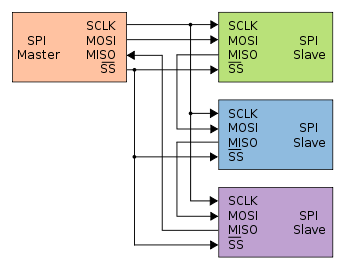
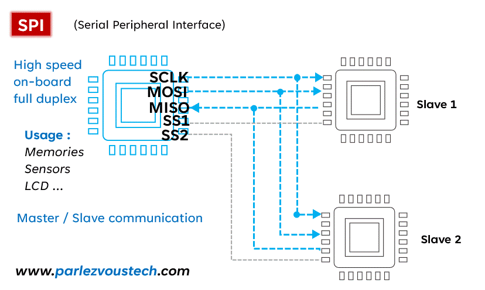
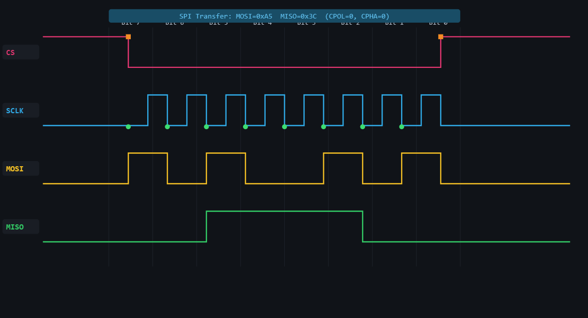

# SPI Communication - Complete Professional Tutorial

## 📌 Introduction

Serial Peripheral Interface (SPI) is a synchronous serial communication protocol widely used for high-speed short-distance communication between microcontrollers and peripherals like displays, ADCs, DACs, sensors, Flash memories, RTCs, and RF modules.

Unlike I2C, SPI does **not** use device addresses on the bus. Instead, the master selects a slave using a dedicated **CS / SS (Chip Select / Slave Select)** line.

---

## 🧠 Key Concepts

- **Four-wire interface**:
  - SCLK (Serial Clock)
  - MOSI (Master Out, Slave In)
  - MISO (Master In, Slave Out)
  - CS / SS (Chip Select / Slave Select)
- **Master-Slave architecture**
- **Full-duplex communication**
- **High-speed synchronous transfer**
- **Clock polarity and phase configurable**
- **Chip-select-based communication**

---

## 🌐 SPI Communication Simulator Link

[Add SPI Simulator Here](SPI_Communication_Simulator.html)

---

## 🔌 Basic SPI Connection Diagram



---

## 🎞️ SPI Working Animation (GIF)



---

## ⚙️ How SPI Works (Step-by-Step)

### 1. Chip Select Assertion
- Master pulls **CS LOW** to select a slave device

### 2. Clock Generation
- Master generates **SCLK**
- Slave uses this clock to shift data in and out

### 3. Simultaneous Data Transfer
- Master transmits data on **MOSI**
- Slave transmits data on **MISO**
- Data transfer is usually **full-duplex**

### 4. Command / Address / Data Phase
- Many SPI devices expect:
  - command byte
  - register or memory address
  - optional dummy byte(s)
  - data bytes

### 5. Chip Select Deassertion
- Master releases **CS HIGH**
- Transaction ends

---

## 📦 Data Format

```text
| CS LOW | COMMAND | ADDRESS (optional) | DUMMY (optional) | DATA | CS HIGH |
```

**Important:** SPI frame format is **device-specific**.
Some devices use only raw bytes, while others require command + address + dummy + data.

---

## 🔢 SPI Modes (CPOL and CPHA)

SPI supports 4 standard modes based on:

- **CPOL** = Clock Polarity
- **CPHA** = Clock Phase

### Mode 0
- CPOL = 0
- CPHA = 0
- Clock idle LOW
- Data sampled on rising edge

### Mode 1
- CPOL = 0
- CPHA = 1
- Clock idle LOW
- Data sampled on falling edge

### Mode 2
- CPOL = 1
- CPHA = 0
- Clock idle HIGH
- Data sampled on falling edge

### Mode 3
- CPOL = 1
- CPHA = 1
- Clock idle HIGH
- Data sampled on rising edge

---

## 🔢 8-bit vs 16-bit Register Addressing

Many SPI devices internally use registers or memory locations.

### 8-bit Register Addressing
- Common in sensors and simple peripherals
- One register byte sent after command

### 16-bit Register Addressing
- Common in Flash memories, displays, and large memory devices
- Two address bytes are sent:
  - high byte first
  - low byte second

---

## 📥 8-bit vs 16-bit Data

### 8-bit Data
- One byte transferred

### 16-bit Data
- Two bytes transferred
- Usually **MSB first** unless the device datasheet says otherwise

---

## 🔁 Read & Write Flow

### 📝 Write Operation
1. Pull CS LOW
2. Send write command
3. Send register / memory address
4. Send data byte(s)
5. Pull CS HIGH

### 📖 Read Operation
1. Pull CS LOW
2. Send read command
3. Send register / memory address
4. Send dummy byte(s) if required
5. Read returned byte(s)
6. Pull CS HIGH

---

## 🧩 ESP-IDF SPI Examples

The examples below cover common SPI use cases:

- command-only transfer
- full-duplex single-byte transfer
- 8-bit register + 8-bit data
- 8-bit register + 16-bit data
- 16-bit register + 8-bit data
- 16-bit register + 16-bit data
- single-byte read/write
- multi-byte read/write

### ESP-IDF Setup

```c
#include "driver/spi_master.h"
#include "esp_err.h"
#include <string.h>

#define SPI_HOST_USED   SPI2_HOST
#define PIN_NUM_MOSI    23
#define PIN_NUM_MISO    19
#define PIN_NUM_CLK     18
#define PIN_NUM_CS      5

static spi_device_handle_t spi_dev;

static esp_err_t spi_master_init(void)
{
    spi_bus_config_t buscfg = {
        .mosi_io_num = PIN_NUM_MOSI,
        .miso_io_num = PIN_NUM_MISO,
        .sclk_io_num = PIN_NUM_CLK,
        .quadwp_io_num = -1,
        .quadhd_io_num = -1,
        .max_transfer_sz = 256,
    };

    spi_device_interface_config_t devcfg = {
        .clock_speed_hz = 1 * 1000 * 1000,
        .mode = 0,
        .spics_io_num = PIN_NUM_CS,
        .queue_size = 4,
    };

    ESP_ERROR_CHECK(spi_bus_initialize(SPI_HOST_USED, &buscfg, SPI_DMA_CH_AUTO));
    return spi_bus_add_device(SPI_HOST_USED, &devcfg, &spi_dev);
}
```

### 1) Write Command Only

```c
esp_err_t spi_write_command(uint8_t cmd)
{
    spi_transaction_t t;
    memset(&t, 0, sizeof(t));

    t.length = 8;
    t.tx_buffer = &cmd;

    return spi_device_transmit(spi_dev, &t);
}
```

### 2) Full-Duplex Single-Byte Transfer

```c
esp_err_t spi_transfer_byte(uint8_t tx_data, uint8_t *rx_data)
{
    if (rx_data == NULL) return ESP_ERR_INVALID_ARG;

    spi_transaction_t t;
    memset(&t, 0, sizeof(t));

    t.length = 8;
    t.tx_buffer = &tx_data;
    t.rx_buffer = rx_data;

    return spi_device_transmit(spi_dev, &t);
}
```

### 3) Write 8-bit Data to 8-bit Register Address

```c
esp_err_t spi_write_reg8_data8(uint8_t cmd, uint8_t reg_addr, uint8_t data)
{
    uint8_t tx[3] = { cmd, reg_addr, data };

    spi_transaction_t t;
    memset(&t, 0, sizeof(t));

    t.length = 8 * sizeof(tx);
    t.tx_buffer = tx;

    return spi_device_transmit(spi_dev, &t);
}
```

### 4) Read 8-bit Data from 8-bit Register Address

```c
esp_err_t spi_read_reg8_data8(uint8_t cmd, uint8_t reg_addr, uint8_t *data)
{
    if (data == NULL) return ESP_ERR_INVALID_ARG;

    uint8_t tx[3] = { cmd, reg_addr, 0x00 };
    uint8_t rx[3] = { 0 };

    spi_transaction_t t;
    memset(&t, 0, sizeof(t));

    t.length = 8 * sizeof(tx);
    t.tx_buffer = tx;
    t.rx_buffer = rx;

    esp_err_t ret = spi_device_transmit(spi_dev, &t);
    if (ret == ESP_OK) {
        *data = rx[2];
    }
    return ret;
}
```

### 5) Write 16-bit Data to 8-bit Register Address

```c
esp_err_t spi_write_reg8_data16(uint8_t cmd, uint8_t reg_addr, uint16_t data)
{
    uint8_t tx[4];
    tx[0] = cmd;
    tx[1] = reg_addr;
    tx[2] = (uint8_t)(data >> 8);
    tx[3] = (uint8_t)(data & 0xFF);

    spi_transaction_t t;
    memset(&t, 0, sizeof(t));

    t.length = 8 * sizeof(tx);
    t.tx_buffer = tx;

    return spi_device_transmit(spi_dev, &t);
}
```

### 6) Read 16-bit Data from 8-bit Register Address

```c
esp_err_t spi_read_reg8_data16(uint8_t cmd, uint8_t reg_addr, uint16_t *data)
{
    if (data == NULL) return ESP_ERR_INVALID_ARG;

    uint8_t tx[4] = { cmd, reg_addr, 0x00, 0x00 };
    uint8_t rx[4] = { 0 };

    spi_transaction_t t;
    memset(&t, 0, sizeof(t));

    t.length = 8 * sizeof(tx);
    t.tx_buffer = tx;
    t.rx_buffer = rx;

    esp_err_t ret = spi_device_transmit(spi_dev, &t);
    if (ret == ESP_OK) {
        *data = ((uint16_t)rx[2] << 8) | rx[3];
    }
    return ret;
}
```

### 7) Write 8-bit Data to 16-bit Register Address

```c
esp_err_t spi_write_reg16_data8(uint8_t cmd, uint16_t reg_addr, uint8_t data)
{
    uint8_t tx[4];
    tx[0] = cmd;
    tx[1] = (uint8_t)(reg_addr >> 8);
    tx[2] = (uint8_t)(reg_addr & 0xFF);
    tx[3] = data;

    spi_transaction_t t;
    memset(&t, 0, sizeof(t));

    t.length = 8 * sizeof(tx);
    t.tx_buffer = tx;

    return spi_device_transmit(spi_dev, &t);
}
```

### 8) Read 8-bit Data from 16-bit Register Address

```c
esp_err_t spi_read_reg16_data8(uint8_t cmd, uint16_t reg_addr, uint8_t *data)
{
    if (data == NULL) return ESP_ERR_INVALID_ARG;

    uint8_t tx[4] = {
        cmd,
        (uint8_t)(reg_addr >> 8),
        (uint8_t)(reg_addr & 0xFF),
        0x00
    };
    uint8_t rx[4] = { 0 };

    spi_transaction_t t;
    memset(&t, 0, sizeof(t));

    t.length = 8 * sizeof(tx);
    t.tx_buffer = tx;
    t.rx_buffer = rx;

    esp_err_t ret = spi_device_transmit(spi_dev, &t);
    if (ret == ESP_OK) {
        *data = rx[3];
    }
    return ret;
}
```

### 9) Write 16-bit Data to 16-bit Register Address

```c
esp_err_t spi_write_reg16_data16(uint8_t cmd, uint16_t reg_addr, uint16_t data)
{
    uint8_t tx[5];
    tx[0] = cmd;
    tx[1] = (uint8_t)(reg_addr >> 8);
    tx[2] = (uint8_t)(reg_addr & 0xFF);
    tx[3] = (uint8_t)(data >> 8);
    tx[4] = (uint8_t)(data & 0xFF);

    spi_transaction_t t;
    memset(&t, 0, sizeof(t));

    t.length = 8 * sizeof(tx);
    t.tx_buffer = tx;

    return spi_device_transmit(spi_dev, &t);
}
```

### 10) Read 16-bit Data from 16-bit Register Address

```c
esp_err_t spi_read_reg16_data16(uint8_t cmd, uint16_t reg_addr, uint16_t *data)
{
    if (data == NULL) return ESP_ERR_INVALID_ARG;

    uint8_t tx[5] = {
        cmd,
        (uint8_t)(reg_addr >> 8),
        (uint8_t)(reg_addr & 0xFF),
        0x00,
        0x00
    };
    uint8_t rx[5] = { 0 };

    spi_transaction_t t;
    memset(&t, 0, sizeof(t));

    t.length = 8 * sizeof(tx);
    t.tx_buffer = tx;
    t.rx_buffer = rx;

    esp_err_t ret = spi_device_transmit(spi_dev, &t);
    if (ret == ESP_OK) {
        *data = ((uint16_t)rx[3] << 8) | rx[4];
    }
    return ret;
}
```

### 11) Multi-Byte Read from 8-bit Register Address

```c
esp_err_t spi_read_reg8_buffer(uint8_t cmd, uint8_t reg_addr, uint8_t *buf, size_t len)
{
    if (buf == NULL || len == 0) return ESP_ERR_INVALID_ARG;

    uint8_t tx[len + 2];
    uint8_t rx[len + 2];

    memset(tx, 0, sizeof(tx));
    memset(rx, 0, sizeof(rx));

    tx[0] = cmd;
    tx[1] = reg_addr;

    spi_transaction_t t;
    memset(&t, 0, sizeof(t));

    t.length = 8 * sizeof(tx);
    t.tx_buffer = tx;
    t.rx_buffer = rx;

    esp_err_t ret = spi_device_transmit(spi_dev, &t);
    if (ret == ESP_OK) {
        memcpy(buf, &rx[2], len);
    }
    return ret;
}
```

### 12) Multi-Byte Write to 16-bit Register Address

```c
esp_err_t spi_write_reg16_buffer(uint8_t cmd, uint16_t reg_addr, const uint8_t *buf, size_t len)
{
    if (buf == NULL || len == 0) return ESP_ERR_INVALID_ARG;

    uint8_t tx[len + 3];
    tx[0] = cmd;
    tx[1] = (uint8_t)(reg_addr >> 8);
    tx[2] = (uint8_t)(reg_addr & 0xFF);
    memcpy(&tx[3], buf, len);

    spi_transaction_t t;
    memset(&t, 0, sizeof(t));

    t.length = 8 * (len + 3);
    t.tx_buffer = tx;

    return spi_device_transmit(spi_dev, &t);
}
```

### ESP-IDF Example Usage

```c
void app_main(void)
{
    ESP_ERROR_CHECK(spi_master_init());

    uint8_t value8;
    uint16_t value16;
    uint8_t buf[4];

    spi_write_reg8_data8(0x02, 0x10, 0xAB);
    spi_read_reg8_data8(0x03, 0x10, &value8);

    spi_write_reg8_data16(0x02, 0x20, 0x1234);
    spi_read_reg8_data16(0x03, 0x20, &value16);

    spi_write_reg16_data8(0x02, 0x1234, 0x5A);
    spi_read_reg16_data8(0x03, 0x1234, &value8);

    spi_write_reg16_data16(0x02, 0x1234, 0xBEEF);
    spi_read_reg16_data16(0x03, 0x1234, &value16);

    spi_read_reg8_buffer(0x03, 0x30, buf, sizeof(buf));
}
```

---

## 🧩 STM32 HAL Examples

STM32 HAL provides simple blocking, interrupt, and DMA SPI APIs.
For this tutorial, the examples use **polling mode** for clarity.

### STM32 Setup Assumption

```c
#include "stm32f1xx_hal.h"

extern SPI_HandleTypeDef hspi1;
```

### 1) Write Command Only

```c
HAL_StatusTypeDef stm32_spi_write_command(uint8_t cmd)
{
    return HAL_SPI_Transmit(&hspi1, &cmd, 1, 100);
}
```

### 2) Full-Duplex Single-Byte Transfer

```c
HAL_StatusTypeDef stm32_spi_transfer_byte(uint8_t tx_data, uint8_t *rx_data)
{
    return HAL_SPI_TransmitReceive(&hspi1, &tx_data, rx_data, 1, 100);
}
```

### 3) Write 8-bit Data to 8-bit Register Address

```c
HAL_StatusTypeDef stm32_spi_write_reg8_data8(uint8_t cmd, uint8_t reg_addr, uint8_t data)
{
    uint8_t tx[3] = { cmd, reg_addr, data };
    return HAL_SPI_Transmit(&hspi1, tx, 3, 100);
}
```

### 4) Read 8-bit Data from 8-bit Register Address

```c
HAL_StatusTypeDef stm32_spi_read_reg8_data8(uint8_t cmd, uint8_t reg_addr, uint8_t *data)
{
    uint8_t tx[3] = { cmd, reg_addr, 0x00 };
    uint8_t rx[3] = { 0 };

    HAL_StatusTypeDef ret = HAL_SPI_TransmitReceive(&hspi1, tx, rx, 3, 100);
    if (ret == HAL_OK && data != NULL) {
        *data = rx[2];
    }
    return ret;
}
```

### 5) Write 16-bit Data to 8-bit Register Address

```c
HAL_StatusTypeDef stm32_spi_write_reg8_data16(uint8_t cmd, uint8_t reg_addr, uint16_t data)
{
    uint8_t tx[4];
    tx[0] = cmd;
    tx[1] = reg_addr;
    tx[2] = (uint8_t)(data >> 8);
    tx[3] = (uint8_t)(data & 0xFF);

    return HAL_SPI_Transmit(&hspi1, tx, 4, 100);
}
```

### 6) Read 16-bit Data from 8-bit Register Address

```c
HAL_StatusTypeDef stm32_spi_read_reg8_data16(uint8_t cmd, uint8_t reg_addr, uint16_t *data)
{
    uint8_t tx[4] = { cmd, reg_addr, 0x00, 0x00 };
    uint8_t rx[4] = { 0 };

    HAL_StatusTypeDef ret = HAL_SPI_TransmitReceive(&hspi1, tx, rx, 4, 100);
    if (ret == HAL_OK && data != NULL) {
        *data = ((uint16_t)rx[2] << 8) | rx[3];
    }
    return ret;
}
```

### 7) Write 8-bit Data to 16-bit Register Address

```c
HAL_StatusTypeDef stm32_spi_write_reg16_data8(uint8_t cmd, uint16_t reg_addr, uint8_t data)
{
    uint8_t tx[4];
    tx[0] = cmd;
    tx[1] = (uint8_t)(reg_addr >> 8);
    tx[2] = (uint8_t)(reg_addr & 0xFF);
    tx[3] = data;

    return HAL_SPI_Transmit(&hspi1, tx, 4, 100);
}
```

### 8) Read 8-bit Data from 16-bit Register Address

```c
HAL_StatusTypeDef stm32_spi_read_reg16_data8(uint8_t cmd, uint16_t reg_addr, uint8_t *data)
{
    uint8_t tx[4] = {
        cmd,
        (uint8_t)(reg_addr >> 8),
        (uint8_t)(reg_addr & 0xFF),
        0x00
    };
    uint8_t rx[4] = { 0 };

    HAL_StatusTypeDef ret = HAL_SPI_TransmitReceive(&hspi1, tx, rx, 4, 100);
    if (ret == HAL_OK && data != NULL) {
        *data = rx[3];
    }
    return ret;
}
```

### 9) Write 16-bit Data to 16-bit Register Address

```c
HAL_StatusTypeDef stm32_spi_write_reg16_data16(uint8_t cmd, uint16_t reg_addr, uint16_t data)
{
    uint8_t tx[5];
    tx[0] = cmd;
    tx[1] = (uint8_t)(reg_addr >> 8);
    tx[2] = (uint8_t)(reg_addr & 0xFF);
    tx[3] = (uint8_t)(data >> 8);
    tx[4] = (uint8_t)(data & 0xFF);

    return HAL_SPI_Transmit(&hspi1, tx, 5, 100);
}
```

### 10) Read 16-bit Data from 16-bit Register Address

```c
HAL_StatusTypeDef stm32_spi_read_reg16_data16(uint8_t cmd, uint16_t reg_addr, uint16_t *data)
{
    uint8_t tx[5] = {
        cmd,
        (uint8_t)(reg_addr >> 8),
        (uint8_t)(reg_addr & 0xFF),
        0x00,
        0x00
    };
    uint8_t rx[5] = { 0 };

    HAL_StatusTypeDef ret = HAL_SPI_TransmitReceive(&hspi1, tx, rx, 5, 100);
    if (ret == HAL_OK && data != NULL) {
        *data = ((uint16_t)rx[3] << 8) | rx[4];
    }
    return ret;
}
```

### 11) Write Multiple Bytes to 8-bit Register Address

```c
HAL_StatusTypeDef stm32_spi_write_reg8_buffer(uint8_t cmd, uint8_t reg_addr,
                                              uint8_t *buf, uint16_t len)
{
    uint8_t tx[len + 2];
    tx[0] = cmd;
    tx[1] = reg_addr;
    memcpy(&tx[2], buf, len);

    return HAL_SPI_Transmit(&hspi1, tx, len + 2, 100);
}
```

### 12) Read Multiple Bytes from 16-bit Register Address

```c
HAL_StatusTypeDef stm32_spi_read_reg16_buffer(uint8_t cmd, uint16_t reg_addr,
                                              uint8_t *buf, uint16_t len)
{
    uint8_t tx[len + 3];
    uint8_t rx[len + 3];

    memset(tx, 0, sizeof(tx));
    memset(rx, 0, sizeof(rx));

    tx[0] = cmd;
    tx[1] = (uint8_t)(reg_addr >> 8);
    tx[2] = (uint8_t)(reg_addr & 0xFF);

    HAL_StatusTypeDef ret = HAL_SPI_TransmitReceive(&hspi1, tx, rx, len + 3, 100);
    if (ret == HAL_OK && buf != NULL) {
        memcpy(buf, &rx[3], len);
    }
    return ret;
}
```

### STM32 Example Usage

```c
void example_spi_transactions(void)
{
    uint8_t value8;
    uint16_t value16;
    uint8_t buf[4];

    stm32_spi_write_reg8_data8(0x02, 0x10, 0xAA);
    stm32_spi_read_reg8_data8(0x03, 0x10, &value8);

    stm32_spi_write_reg8_data16(0x02, 0x20, 0x1122);
    stm32_spi_read_reg8_data16(0x03, 0x20, &value16);

    stm32_spi_write_reg16_data8(0x02, 0x1234, 0x77);
    stm32_spi_read_reg16_data8(0x03, 0x1234, &value8);

    stm32_spi_write_reg16_data16(0x02, 0x1234, 0x3344);
    stm32_spi_read_reg16_data16(0x03, 0x1234, &value16);

    stm32_spi_read_reg16_buffer(0x03, 0x2000, buf, sizeof(buf));
}
```

---

## ⚡ Important Notes

- SPI usually needs one **CS line per slave**
- SPI is generally faster than I2C
- No pull-up resistors required like I2C
- Master always generates the clock
- Some devices require **dummy clocks / dummy bytes** before read data becomes valid
- Some devices support **MSB-first** or **LSB-first**
- Always match:
  - SPI mode
  - clock speed
  - bit order
  - frame format

---

## 🛠️ Troubleshooting

- No response -> Check CS wiring and SPI mode
- Wrong data -> Check CPOL / CPHA settings
- All zeros / all 0xFF -> Check MISO connection and dummy bytes
- Data shifted incorrectly -> Check bit order and clock edge
- Works sometimes -> Reduce SPI clock speed and verify signal quality

---

## 🔬 How MCU Handles 8-bit and 16-bit Address/Data Internally

### 8-bit Register Address
When a device uses an 8-bit register address, the MCU typically sends:

```text
CS LOW
COMMAND
REG_ADDR (8-bit)
DATA...
CS HIGH
```

### 16-bit Register Address
When a device uses a 16-bit register or memory address, the MCU typically sends:

```text
CS LOW
COMMAND
REG_ADDR_HIGH
REG_ADDR_LOW
DATA...
CS HIGH
```

### 8-bit Data
For 8-bit data, only one byte is transferred:

```text
DATA = 0x5A
```

### 16-bit Data
For 16-bit data, two bytes are transferred, usually MSB first:

```text
DATA_HIGH = 0x12
DATA_LOW  = 0x34
```

Combined value:

```text
0x1234
```

### Important Rule
**Register/address width** and **data width** are different things.

Examples:
- sensor may use **8-bit register address** and **8-bit data**
- Flash memory may use **16-bit or 24-bit address** and **8-bit data**
- ADC may use **8-bit register address** and return **16-bit data**
- display controller may use **command + data stream** without a normal register map

So always check the datasheet for:
- command format
- register / memory address size
- data size
- byte order
- dummy cycles
- SPI mode

---

## 📚 Summary

- SPI uses clocked serial communication
- Usually 4 wires: SCLK, MOSI, MISO, CS
- Full-duplex transfer is possible
- Faster than I2C in many applications
- Each slave usually needs its own CS line
- Frame format depends on the device datasheet

---

## 🚀 Bonus: Logic Analyzer View



---

## 📌 References

- ESP-IDF SPI Master Driver:
  https://docs.espressif.com/projects/esp-idf/en/stable/esp32/api-reference/peripherals/spi_master.html
- STM32 HAL SPI How To Use:
  https://dev.st.com/stm32cube-docs/stm32c5xx-hal-drivers/2.0.0/en/docs/drivers/hal_drivers/spi/hal_spi_how_to_use.html

---

**End of Document**
