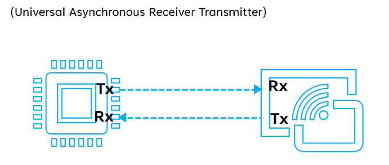

# UART Communication -- Complete Professional Tutorial

## 📌 Introduction

Universal Asynchronous Receiver-Transmitter (UART) is one of the most
widely used serial communication protocols in embedded systems. It
enables data exchange between microcontrollers, computers, sensors, GPS
modules, Bluetooth modules, modems, and many other peripherals using
asynchronous serial communication.

------------------------------------------------------------------------

## 🧠 Key Concepts

-   **Two main signals**:
    -   TX (Transmit)
    -   RX (Receive)
-   **Asynchronous communication**
-   **Full-duplex communication**
-   **No clock line required**
-   **Configurable baud rate, parity, and stop bits**

------------------------------------------------------------------------

## 🔌 Basic UART Connection Diagram

------------------------------------------------------------------------

## ⚙️ How UART Works (Step-by-Step)

### 1. Idle State

-   TX and RX lines remain HIGH when no data is being transmitted

### 2. Start Bit

-   Transmission begins with one **LOW** start bit

### 3. Data Bits

-   Typically 8 data bits are sent
-   LSB first

### 4. Optional Parity Bit

-   Used for error detection

### 5. Stop Bit(s)

-   One or more stop bits indicate the end

------------------------------------------------------------------------

## 📦 Data Format

    | IDLE | START | DATA | PARITY | STOP |

------------------------------------------------------------------------

## 🔢 Common UART Frame Formats

-   8N1 (most common)
-   8E1
-   8O1

------------------------------------------------------------------------

## 📥 Baud Rate

Common: - 9600 - 115200

------------------------------------------------------------------------

## 📚 Summary

-   Uses TX/RX
-   No clock
-   Simple and powerful

------------------------------------------------------------------------

**End of Document**
